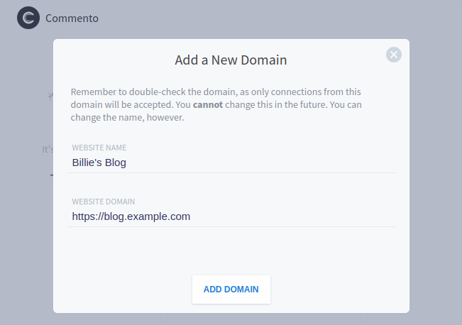

### Configuring the frontend

#### Introduction

Commento's frontend configuration allows you to modify the appearance of the embedded comments box. For example, you can specifying a custom CSS stylesheet to override Commento's default appearance to match the look and feel of your website. In this page, we document how to embed Commento in your website and the exhaustive list of frontend settings you can configure.

#### Embedding Commento on your website

For the sake of examples, let's assume you're hosting Commento at `http://commento.example.com` (you can change this [in the backend](configuration-backend.md)). First, [create an account](http://commento.example.com/signup) in the dashboard (replace the link with your domain). Following this, [log in](http://commento.example.com/login) with your credentials. Next, use the button on the left hand side to register your domain.

<p style="text-align: center"></img></p>

You can now embed Commento in your domain with a few lines of simple HTML.

```
<script defer
  src="http://commento.example.com/js/commento.js">
</script>
<div id="commento"></div>
```

#### Configuring settings

You can configure additional frontend settings by adding `data` attributes to the `<script>` tag. For example, to specify custom CSS styling, you can add a `data-css-override` attribute as follows:

```
<script defer
  src="http://commento.example.com/js/commento.js"
  data-css-override="http://css.example.com/my-custom-styling.css">
</script>
<div id="commento"></div>
```

Here is the list of such options available.

| Parameter | Description |
|---|---|
| <nobr>`data-css-override`</nobr> | An URL to a CSS file with overriding styles. **Optional**, defaults to no file. |
| <nobr>`data-auto-init`</nobr> | Commento automatically initialises itself when the page is loaded. If you prefer to load Commento dynamically, you can set this to `false` and you will be required to call `window.main()` when you want to load Commento. **Optional**, defaults to `true`. |
| <nobr>`data-id-root`</nobr> | By default, Commento looks for a `<div>` with `id="commento"`. If you want to load Commento in a different element, you can set this attribute to the ID of that element. **Optional**, defaults to "commento". |
